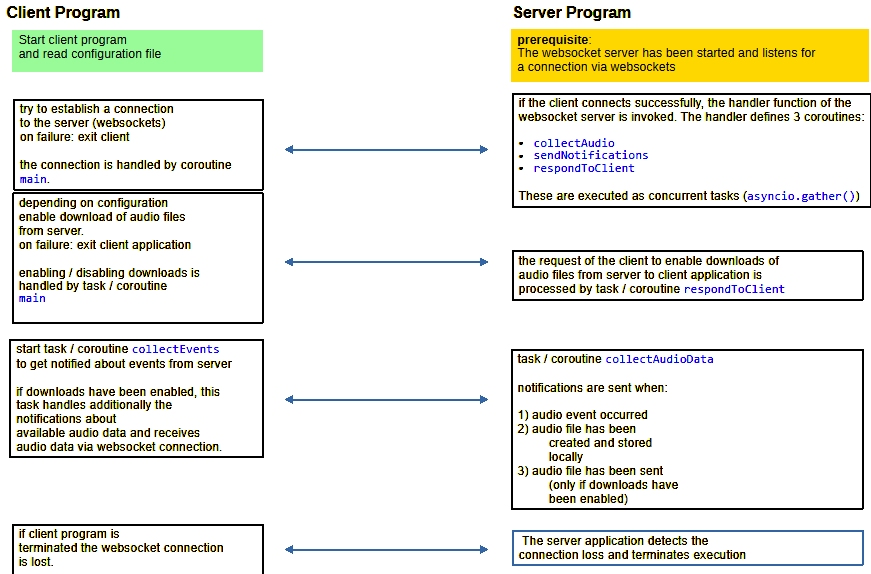

# AUDIO Processing

This project aims at getting familiar with recording audio samples either on a Window PC or on the RaspberryPi.

The code has been tested on a PC with Windows 11 and Python 3.11 and a RaspberryPi 3 (4 GB) and Python 3.9.

**Folder structure**

1) `JupyterNb\AudioProcessing\Audio_1.ipynb`
    
    a) a notebook to explore basic operations of audio processing such as recording and storing audio samples. The notebook demonstrates which libraries are required to access the soundcard. The examples have been tested with a USB soundcard `Creative Soundblaster Play!3`.

    b) basic recording capability as provided by Python library `sounddevice` are demonstrated.

    c) the recommended approach using an `inputStream` with a callback function is described in the notebook.

2) folder `src` provides some test programs for capturing audio data. These programs work on a PC and a Raspberry Pi.

3) other folders are only required to store audio data,  configuration files `cfg_xxyzzy.json` and support files to work with `VS Code`

---

## Test Programs

1) `JupyterNb\AudioProcessing\Audio_1.ipynb`  

    a) how to use the Python libraries `sounddevice` (accessing the soundcard) and `soundfile` (writing audio samples into a file)

2) `src\audio_recording_1.py` 

    a) records a *fixed time span* of audio samples into a `Numpy` array, stops collecting samples after exceeding the time span and storing the collected samples into a soundfile. This program has been tested on Windows 11 and on the Raspberry Pi 3. The main purpose of this program is to show how to pass additional parameters into the callback function (using `functools.partial`) and to use library `soundfile` for creating an audio file. The example uses the `*wav` soundfile format but the library supports other audio file formats as well.

3) `src\audio_recording_2.py`

    a) prior to collecting audio samples an **array of audio buffers** is set up. The number of buffers can be configured as a command line parameter. The program collects audio samples into theses buffers in a *cyclical* fashion. The array of buffer structure allows for processing of audio samples while audio samples are written into another buffer. Typically a buffer can hold a few seconds of audio samples (configurable via command line parameter). When the current buffer is *full* the next buffer is selected as the new current buffer and samples are transferred to this buffer. After stopping the collection of audio samples the buffers are stored in an audio file. 

4) `src\audio_recording_3a.py`

    a) basically this is modification of `src\audio_recording_2.py` with a audio activity detector added. The audio activity detector works like this: each chunk of audio data retrieved from the sounddevice is analysed for audio activity. If a configurable threshold is exceeded a flag is set to indicate a time interval of increased *sound activity*. A sound event triggers to collect a configurable number of buffers to be written into an audio file.

5) `src\audio_recording_3b.py`

    a) `src\audio_recording_3a.py` has shown some deficiencies when being run on the Raspberry Pi (overflow messages). On a PC no such events occurred. On the Raspberry Pi overflow messages can be avoided if the input stream is stopped and closed before writing buffers into an audio file. Then the stream is restarted.  Additionally to writing audio samples into files once a sound event was detected the parameters of each sound event are appended to a list. Prior to exiting the program the list of sound event parameters are stored in a `*.json` file.

6) `src\ws_client_audio_2.py` together with `src\ws_server_audio_2.py` are two separate programs which shall accomplish these tasks:

The server program shall be started first (on a PC#1 or on a Raspberry Pi). The program shall capture audio data using a Soundblaster Audio card. The client program which must be started on another PC#2 **after** the start of the server program tries to connect to the server by establishing a websocket connection. If the connection has been succesful the server start caputuring audio data and may emit audio events if some sound activity has been detected. An audio file stores audio data into a file on the server. The client is notified. If the client has configured the server to enable download of audio files, the server sents audio files over websocket to the client.

The flow of information between client and server program is shown here:

